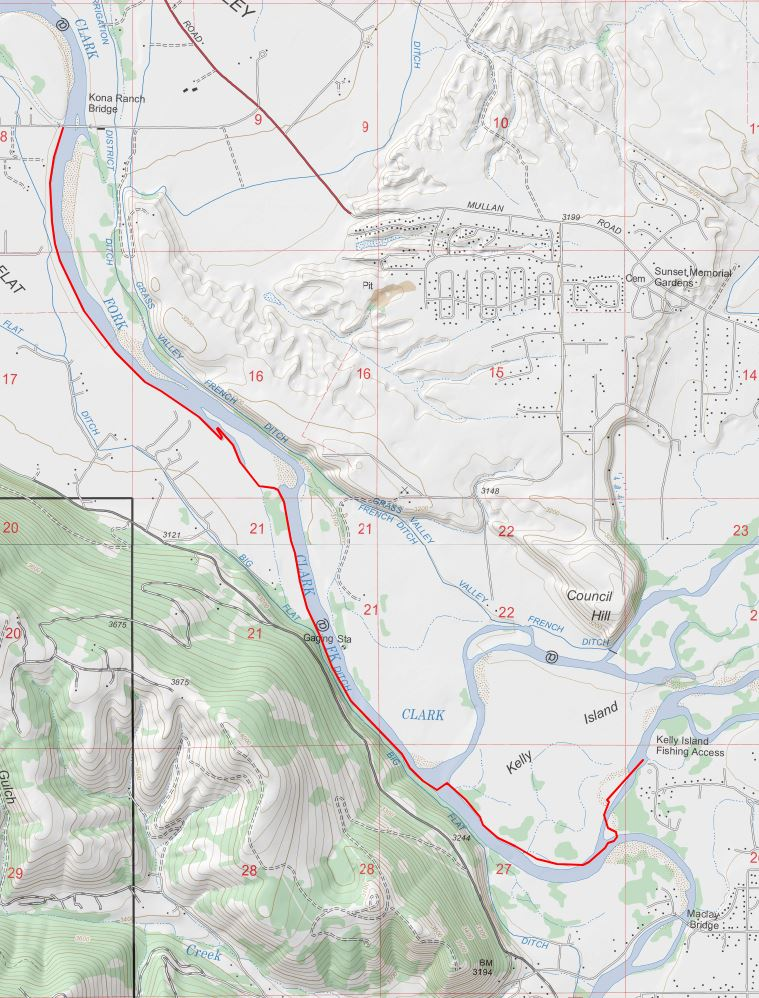
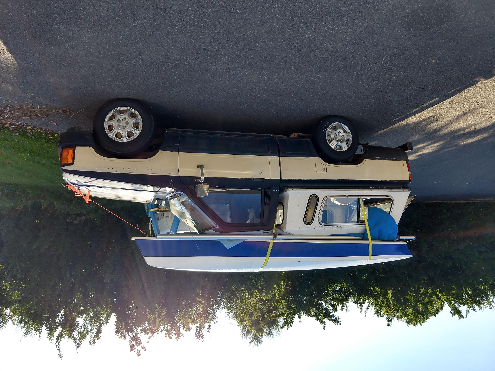
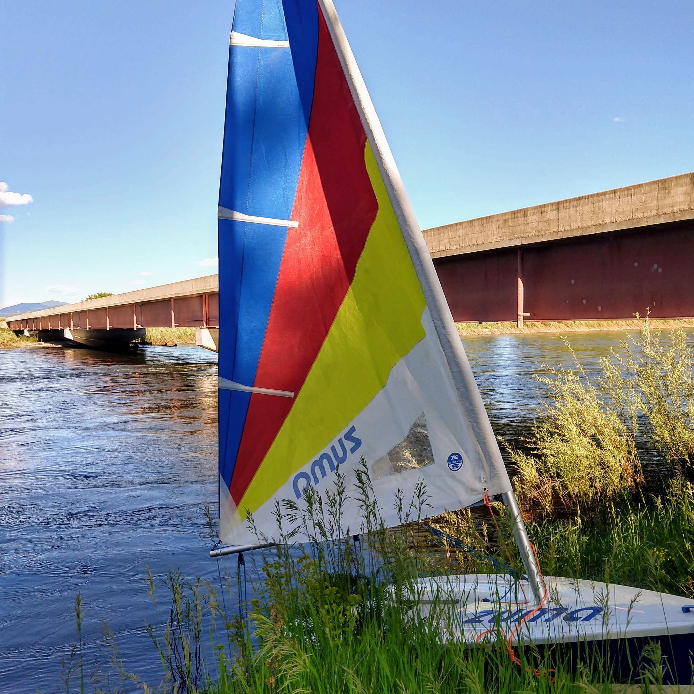

Early summer in Missoula is a dream.  The weather is warming up, and the rivers are starting to calm down from the spring runoff.  My wife likes to call it “fool’s spring.”  Every year I get jazzed up, get out into the mountains, and end up post holing up to my thighs in snow dragging my bike along for the fun of it.  As it turns out, the snow likes to hang around the higher elevations for much longer than it does in the valleys.

Anyway, I wasn’t going to let fool’s spring or the “spring of deception” trick me this year.  There is still adventure o ’plenty to be had with the caveat of sticking to the low country.  Rivers and lakes are the embodiment of the low country around here, so a packraft or sailboat is apt equipment.

It was looking quite nice out in Missoula during mid April, with temperatures hitting the upper 50s.   Lance and I decided that was warm enough to take the sailboat out for the 1st time of the year; we headed out to Placid Lake, about an hour from town.  The campground was still closed, but we figured we would be able to get the boat to the water without an issue.

We were wrong, the gate was locked, and the lake was completely iced over save for the very edges.  We had an inkling that this would be the case because we passed Salmon Lake on the way, and were met with white sheets of ice and snow.  On the inlet side of Salmon Lake, there was some open water, and since we had come all that way, we decided to give it a shot.  Dodging ice sheets and freezing our asses on the boat, we made a couple circuits in the available open water.

So fool’s spring got me again.  Oh well.  I bided my time until the weather improved.
After doing a five day float down the Smith River over Memorial Day, I was feeling pretty river savvy.  The last day of the trip involved a lot of paddling, and the head winds could really slow down the rafts.  Anyway, I got the brilliant idea to sail down the Clark Fork River.  I had never seen a sailboat on the river before, and therefore it would be some great pioneering work.

The plan was to put in at Kelly Island, and take out at Kona Bridge.  It’s about a five mile trip, and I figured that between the current and the wind, I’d make it there in no time.  I loaded up the boat, grabbed a couple of beers in a dry bag, and took off. 

The 1st obstacle was the confluence of the Clark Fork and Bitterroot Rivers.  The river got quite shallow, so I had to pull the dagger board and  pop my rudder up.  I ended up walking the boat through the shallow section until I could get to a deep part again.  Just as soon as I got back in the boat (before I had the daggerboard or rudder down), the current had me headed straight for a big strainer on river left. With no rudder control, I grabbed for the paddle I had brought along and was able to direct myself around the obstacle.

After that I was making it down the river decently.  There was a headwind, directly downriver, but I was able to utilize it by tacking back and forth.  Unlike floating the river in a tube or raft sailing was not relaxing in the slightest, it was all hands on deck.  Deep and shallow sections necessitated raising and lowering the daggerboard to avoid running aground.  If the rudder hit a rock and popped up the combination of the wind and current can spin the boat like a top in an instant.  Several times, I almost dumped.  Even with the daggerboard and rudder down,  there were a couple times where there would be a differential current between the bow and stern. This would cause the boat to spin, and the full sail would be against the wind, which would heel me over dramatically.  I can recall seeing the entire daggerboard out of the water while trying to lean over the side of the boat and let the sail out as fast as I could.

Anyway, after a couple rough patches, I was getting close.  Soon Kona bridge rolled into view, it was directly downstream of the takeout.  I stayed river left so as to be as close as possible, but right above the takeout I encountered a downed tree.  I had the boat stopped by the shore and I could see the takeout and people playing on the beach right on the other side of this downed trunk.  Lifting the boat over it didn’t seem like a great idea, in fact I wasn’t sure how possible that would have been.  The tree was positioned at a diagonal to the river, so that by following along it,  I had to head back out into the depths and current of the river.

Slowly going along the downed tree, I made my way for the last 100 feet down the river, but then disaster struck.  The main  current caught me, as I furiously tried to paddle to the shore.  It looked like I was going to miss the takeout.  This isn’t such a problem most of the time, you just paddle to shore and try to make your way back up stream.  The problem here was that there was Kona bridge immediately downstream of the takeout, and I had a mast that stuck up from the water about 15 feet; it wasn’t going to make it under the bridge.

Without much time to think, I decided to abandon ship.  I slid off the side of the boat and pulled the boat over after me. It didn’t go over all the way, until it got a bit of help from the bridge.  I grabbed the side of the boat, and swam for the shore.  Eventually I was able to obtain shallow enough water to get my feet under me.  By then the boat had swung around so that the mast was facing downstream and the hull was perpendicular to the current.

I inched my way closer to the muddy shore, trying not to slip with the entire crossesction of the Zuma catching the current, dragging me down river.  The closer I got to shore the less current there was and the easier it became.  I got to a stable spot, and was able to right the boat which helped immensely in the ‘getting pulled downstream’ department.   I could face the bow into the current and make my way back up stream by walking along the shore.

When I got back to the bridge, there was no way that I was going to re-capsize the boat to get under it.  There was some easement from the road on this side of the bridge, and I pulled the Zuma up on shore and tied it to a telephone pole.  Solid land felt quite nice!

From here, it was a simple matter of calling an uber ride to drive me back to my truck at the put in, drive back to the takeout, and extract the boat from its location down by the river.  Overall, I’d say that there is no reason to ever again put a sailboat in on this stretch of the Clark Fork River.
