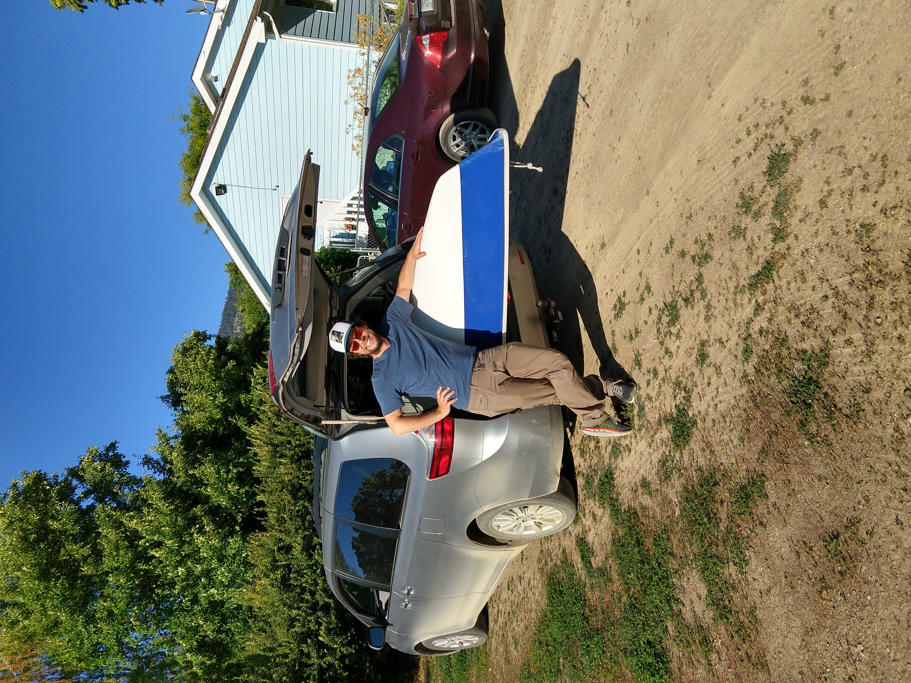
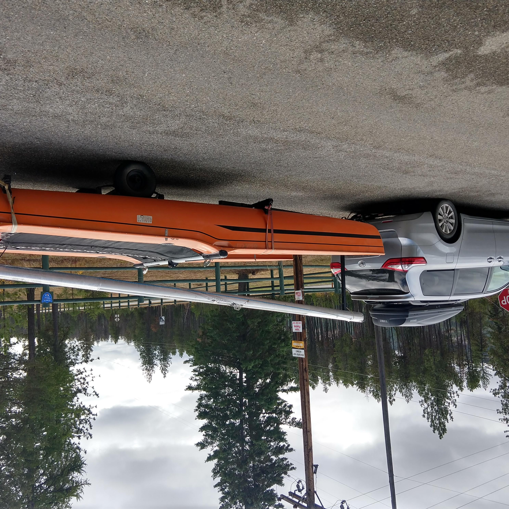
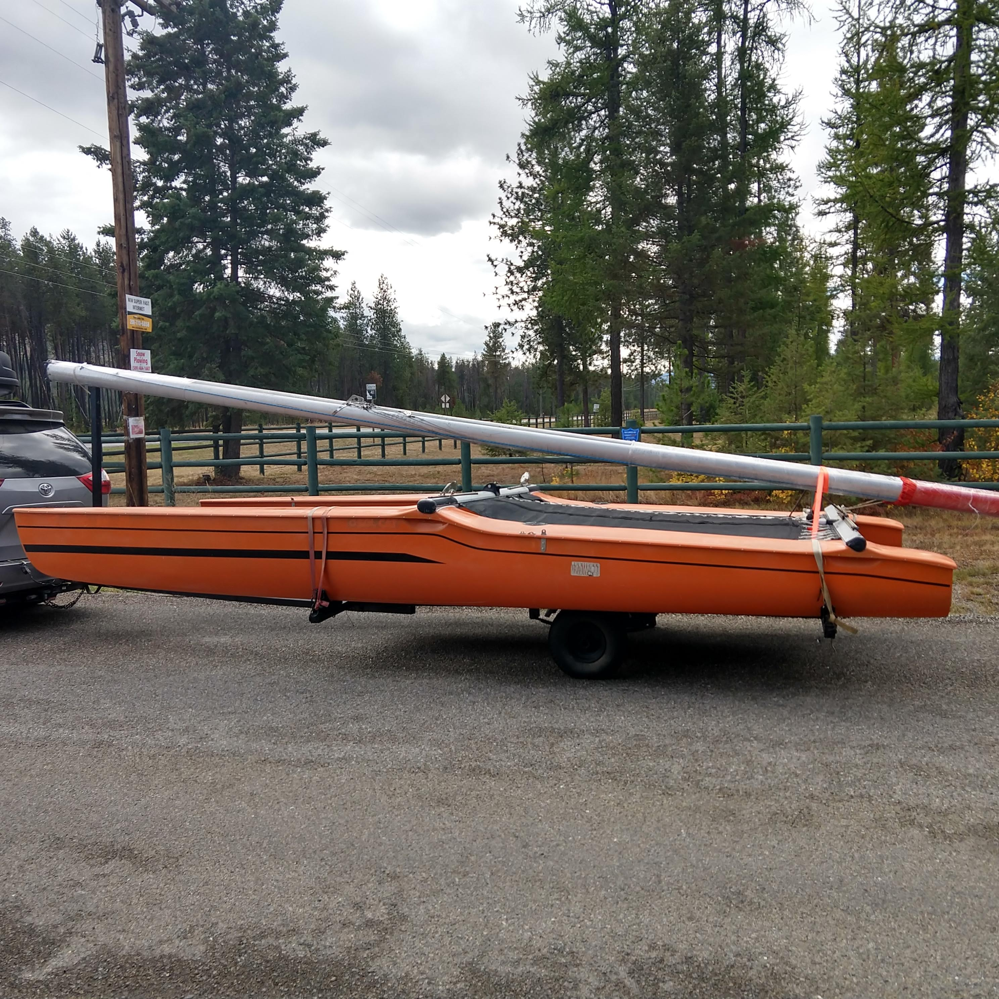

---
title: Intro to backcountry sailing...
date: "2019-05-06T23:46:37.121Z"
description: How I got into sailing in the first place...
---

Intro to backcountry sailing.

It all started when visiting my sister in San Diego for Christmas around 2013.  My parents wanted to take a day trip on the Stars and Stripes, an America's Cup yacht from 1992.  My brother, Lance, and I, while not terribly interested in sailboats, decided to go in order to spend time with our family (we were all living in different cities/states at this time).  Anyhow, it was a blast.  From running the grinders, to tending the helm, we all had a great time.

Several years passed, I ended up moving back to Missoula and was able to hang out with Lance much more often.  In 2018, Lance asked me if I wanted to take a sailing course up on Flathead lake.  Through work, he had a yearly ‘life enrichment’ stipend, and learning how to sail sounded enriching (or impoverishing, as the case may be).  I agreed, and much learning was done during the two day course.

That was it.  I had caught the sailing bug.  The problem was that I now needed a boat.  We rented a 21 foot Capri and sailed it about, for a half day.  It was fun, but much too expensive to do all the time.  My sister-in-law was living on a boat out in the San Juans, but was selling it to upgrade to a larger one.  I would have bought it with a substantial family discount, but I couldn’t figure out a way to get it to Montana without a trailer.

So I kept an eye on Craig’s list.  Many sizes of boats in many stages of distress could be had.  I talked a bit with my wife, and we agreed that it would be better to trailer it rather than pay slip fees all summer.  Obviously that limited the size of boat you could get, but we wanted to limit the size of hole into which we were throwing money.

One day, I saw a 13 foot Zuma for sale for 550$.  It ended up being about 1 mile from my parent’s house in Frenchtown.  I emptied the minivan of car seats, and headed out with Lance to check it out.  We split the cost, stuffed the boat in the back of the minivan, and took off.  For less than the cost of a slip for a month, I now owned half a boat.

Towards the end of the summer, I spotted a sweet looking catamaran in northeast Washington.  My mom was always telling us that when she used to go up to Flathead lake as a kid, they had some cousins with a cat; it was super fast and super fun.  I went, picked it up, and drove it back to Missoula.  

It was toward the end of summer 2018, and I know owned two sailboats.  Two boats, but no extra time.  My time was spent with work, kids, the farm, and other hobbies.  In mid August, we went on a backcountry camping trip through Glacier National Park.  The 1st day was a 6.5 mile hike along the north shore of Bowman lake to 1st backcountry camping site.  On a previous trip with my kids up to Bowman lake, the park rangers had warned us that wind always comes up in the afternoon, and that paddlers can have trouble trouble getting back to the west side of the lake due to the headwind.  Heeding their warning, we didn’t go too far with the kids in the little inflatable.

As we were hiking, the ranger’s advice came to mind, but now I was thinking about it in terms of a sailboat: constant predictable daily winds are great!  If we could sail to the backcountry camping site, that’s a lot less hiking and schlepping of gear that would be required.  We would essentially be backcountry sailing.

